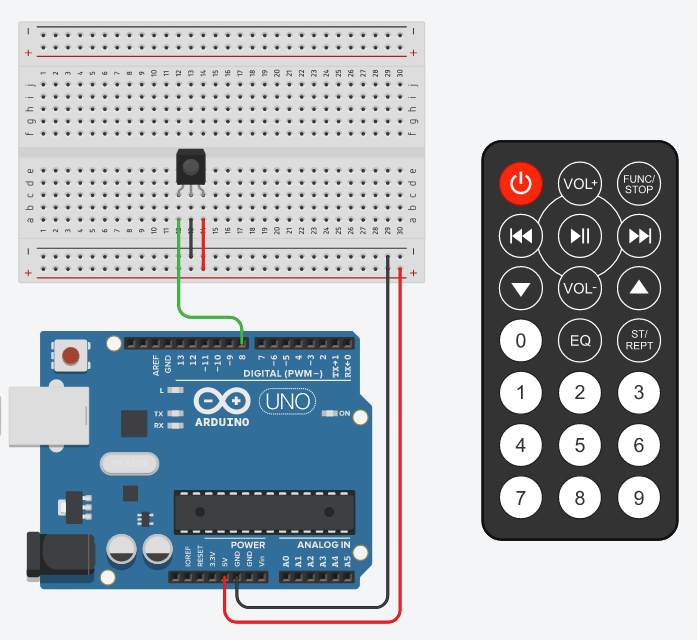

# Basic and Custom Keypad
Note: if you do not have the code for the arduino(https://arduinogetstarted.com/tutorials/arduino-keypad)the 4X4 keypad this program will NOT run correctly
 
**I(being an idiot) numbered the buttons on the matrix module from 1-16 ONLY for the user interactive input, this means that you do NOT have to modify the arduino code. because of this mistake when prompted to assign each button a keybind  BUTTON A ON THE KEYPAD IS BUTTON 4 in the code and so on for all the symbols/letters.**

to be able to run the .exe file you will first need to activate this script for the Custom Keypad
``keypad/build/(select which folder)`` and this one for the Basic Keypad ``Ir Controlller/build/(select which folder)`` once this is run  you will have a new folder called dist the exe file will be located in either ``keypad/dist/`` or ``IR Controller/dist/``.

# IR Controller
** For the ir controller python code to run you first need to upload the ino file to your arduino, you need the IReceiver library version 2.7 specifically, not newer
if you haven't yet wired your receiver,wire it as shown on the diagram below **

The top 9 buttons of the ir controller are configurable with the `ir_python_custom.py` code. the three buttons under that are task manager, screenshot, and windows run menu, the last 9 buttons are hotkeys for the first 9 apps in your taskbar